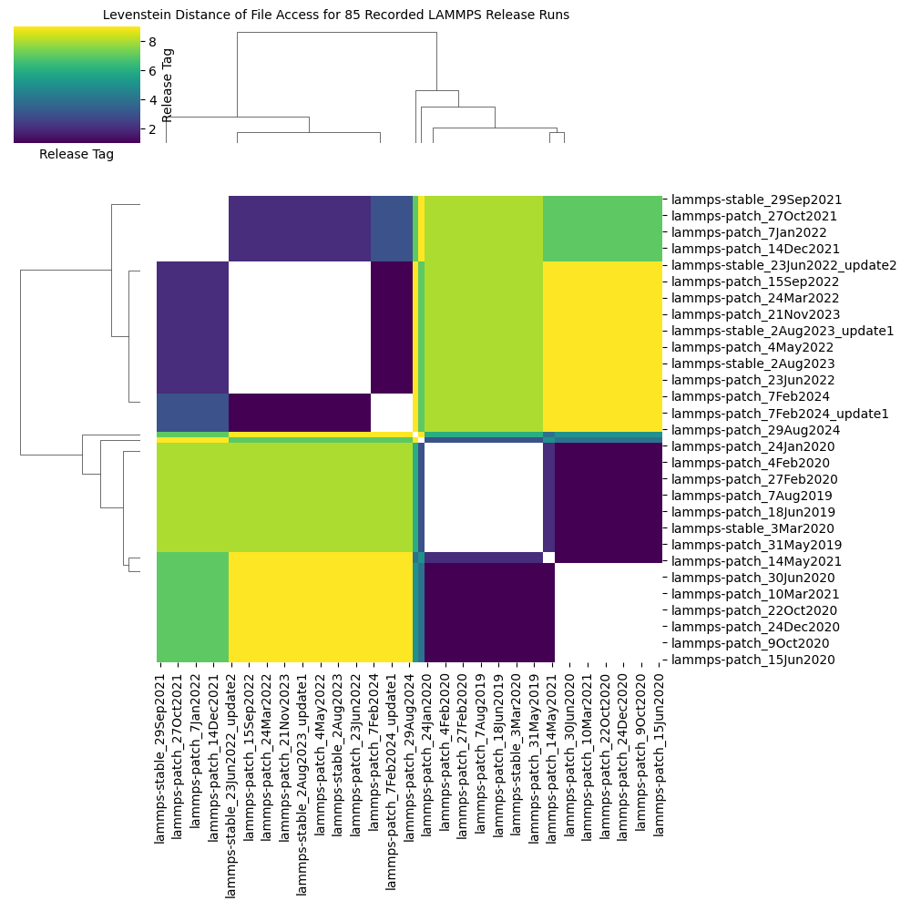
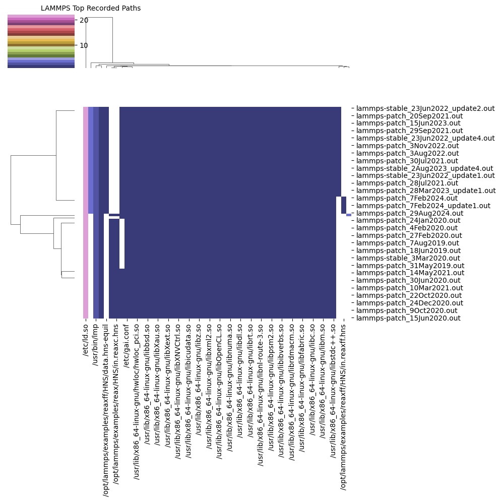
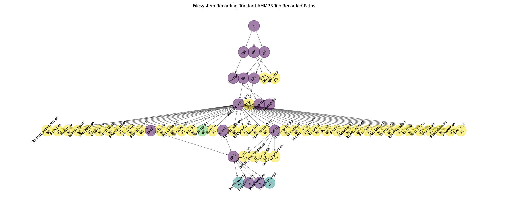

# LAMMPS in Kind

Let's run our LAMMPS containers in kind, meaning we will run the experiment across nodes.

## 1. Create a Cluster

```bash
kind create cluster --config ./kind-config.yaml
```

Install the Flux Operator. Each lammps experiment will be the base container with flux.

```bash
kubectl apply -f https://raw.githubusercontent.com/flux-framework/flux-operator/refs/heads/main/examples/dist/flux-operator.yaml
```

Then run the experiments!

```bash
# Default problem size 4 x 4 x 4 is just under 2 minutes
python run-experiment.py
```

Then parse the single result files into output files for each.

```bash
# gets data from data/raw and parses into results/recordings and results/output
python parse-results.py
```

This will generate the output and recordings directories in [results](results). Next, do the analyses.

```bash
# Generate the distance data frame and levenstein distance clustermap image
compatlib analyze-recording -d ./results --cmap viridis $(find ./results/recordings -name *.out)

# Generate a trie that shows access paths (not order or pattern) and overall count matrix
compatlib plot-recording -d ./results $(find ./results/recordings -name *.out)

# Run markov models, generating a pdf of residuals for each
compatlib run-models -d ./results $(find ./results/recordings -name *.out)
```
```console
Markov Model Results
  Leave one out correct: 4928
    Leave one out wrong: 1219
          correct/total: 0.8016918822189686
Frequency Results
  Leave one out correct: 645
    Leave one out wrong: 5505
          correct/total: 0.1048780487804878
```

Finally, generate a perfetto trace file to visualize events with times:

```bash
compatlib to-perfetto -d ./results $(find ./results/recordings -name *.out)
```

What I see in the above is mostly that the data files take up most of the open time, and the library reads are tiny.
That said, their presence is still important. I think this approach would do better with something that is reading data,
although I'm not sure I have a good solution with fuse-go that isn't able to keep track of a unique identifier.

## Analysis

Here are the corresponding results images to [these](https://github.com/converged-computing/lammps-time/tree/main/fuse/analysis)





The biggest difference is likely seeing paths related to Flux or communication (e.g., MPI). A question I have is if there is something of interest related to doing a diff. For example, how does a LAMMPS run differ under different running conditions (and do we care / is that important in some context)?

