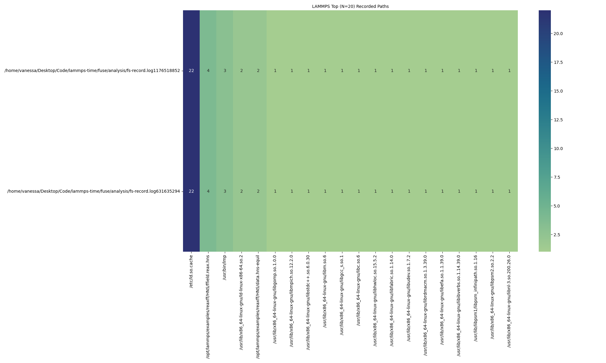

# Analysis Example

These are two logs generated from the same executable, so the paths accessed should be the same. In this directory I want to:

1. Calculate Levenstein Distance (see below)
2. Try to visualize the access
3. Build a trie and put a count at each node that represents the number of paths that hit it.
4. Create features to describe patterns (file lookup or open, not accounting for timestamps), and measure how similar or different two sequences are
5. Then - can we do a total calculation of the percentage of files looked up over the total in the image?

For the last point - can we break files into groups based on access time, package that with metadata, and have that used for a pre-fetch strategy? Where groups are fetched before needed for an application?

## Usage

### 1. Levenstein Distance

Calculate distance between the two:

```bash
python analyze-recording.py fs-record.log1176518852 fs-record.log631635294
```
```console
                        fs-record.log1176518852 fs-record.log631635294
fs-record.log1176518852                       0                      0
fs-record.log631635294                        0                      0
```

### 2. Visualize Access

Lookup is only done once by the filesystem, but Open is done multiple times.
Visualize the access - a basic plot of the paths, and then make opacity based on access rate.

```bash
python plot-recording.py fs-record.log1176518852 fs-record.log631635294
```

In the above, we create a heatmap where access is relative to the whole set (darker is accessed the most).
This will be more interesting when we have more than 2 (actually different) versions of LAMMPS.



### 3. Trie to Describe patterns

### 4. Create Features to Describe Patterns

**TODO**

- Do a compression (or summary of sequences) to get patterns (e.g., AAA, AAB)
- Make a histogram, so find frequency of each pattern
- Once we have histogram, canonicalize the sequences - within a pattern, rename the letters or pattern so always ordered in some way. (e.g., ABC would be the same as CDF because they both are "three different things coming after one another"

