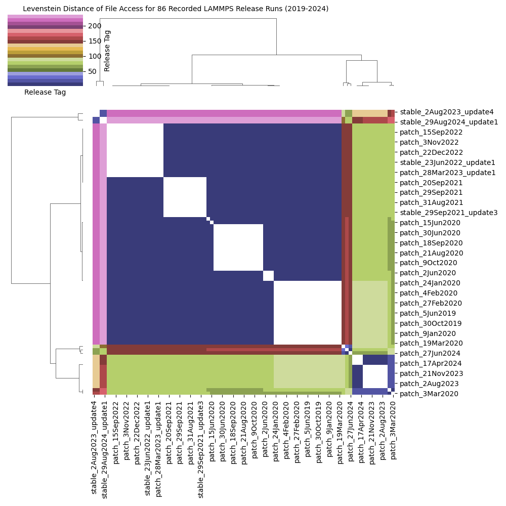
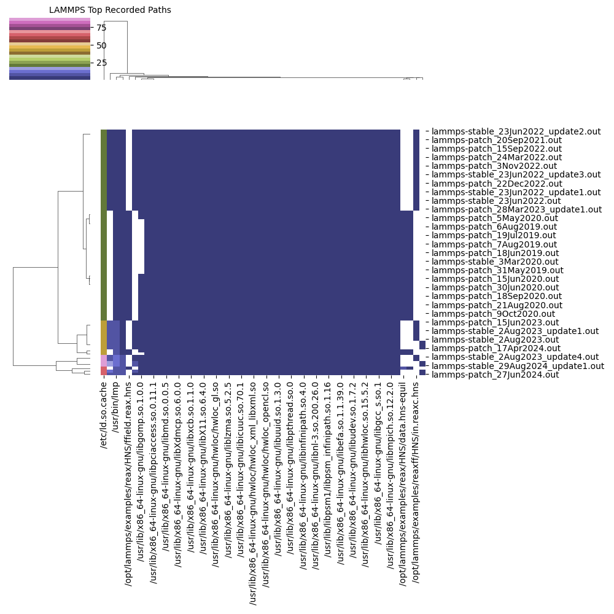
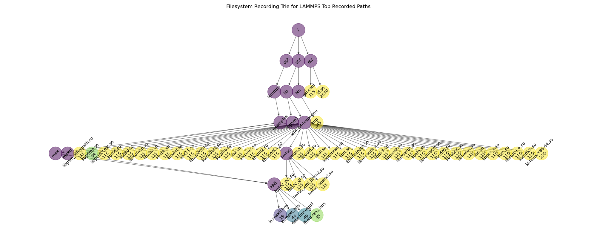
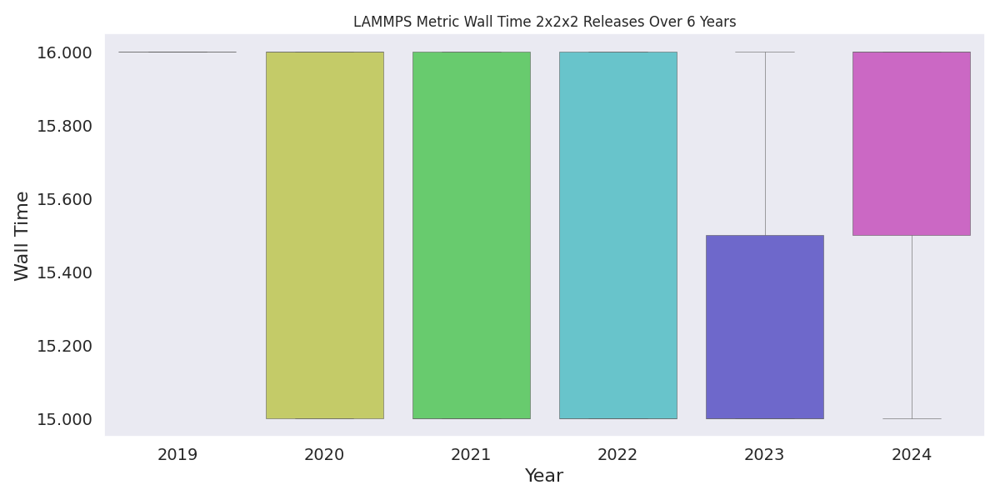

# Analysis Example

These are logs generated from the "same" executable across 86 LAMMPS builds. In this directory I want to:

1. Calculate Levenstein Distance (see below)
2. Try to visualize the access
3. Build a trie and put a count at each node that represents the number of paths that hit it.
4. Look at the actual output and derive if there are changes in the CPU utilization or total runtime.
5. Create features to describe patterns (file lookup or open, not accounting for timestamps), and measure how similar or different two sequences are
6. Can we do a total calculation of the percentage of files looked up over the total in the image?

For the last point - can we break files into groups based on access time, package that with metadata, and have that used for a pre-fetch strategy? Where groups are fetched before needed for an application?

## Usage

### 1. Levenstein Distance

Calculate distance between all pairs:

```bash
python analyze-recording.py $(find ../recording -name *.out)
```
```console
current allocation
                                    lammps-patch_31May2019.out  ... lammps-stable_23Jun2022_update2.out
lammps-patch_31May2019.out                                   0  ...                                   8
lammps-patch_21Jul2020.out                                   4  ...                                   9
lammps-patch_15Jun2020.out                                   3  ...                                   9
lammps-patch_2Aug2023.out                                   84  ...                                  76
lammps-patch_19Mar2020.out                                   0  ...                                   8
...                                                        ...  ...                                 ...
lammps-patch_24Aug2020.out                                   4  ...                                   9
lammps-patch_27Jun2024.out                                 153  ...                                 146
lammps-patch_24Jan2020.out                                   0  ...                                   8
lammps-patch_7Feb2024.out                                   84  ...                                  77
lammps-stable_23Jun2022_update2.out                          8  ...                                   0

[85 rows x 85 columns]
```

This shows levenstein distance, and I like this value because it's a count the represents the number of edits (deletions, subs, or additions) that we have to make to one set of paths to get to the other!



### 2. Visualize Access

Here we will visualize the access - a basic plot of the paths, and then make opacity based on access rate.
Note that the "Lookup" operation is only done once by the filesystem, but Open is done multiple times. So if we want to understand access patterns, we want the latter.  "Lookup" would be important for some kind of cache pre-fetcher because we only care about the first time we see something.

```bash
python plot-recording.py $(find ../recording -name *.out)
```

In the above, we create a heatmap where access is relative to the whole set (darker is accessed the most).
This means in the plot below, darker regions are accessed more. If colors are the same, the paths we acceessed the same number of times. It's fairly simple like that.



### 3. Trie to Describe patterns

We also generate a Trie. For the tree you need pygraphviz:

```bash
conda install --channel conda-forge pygraphviz
```
This took me two hours to write the code for - I wanted the colors to correspond to counts, and be relative to one another, and for the labels to be rotated. Worth it!



### 4. Output changes

There probably isn't an interesting story here, but I thought I'd parse anyway. I'm running this on my local machine (one node) so it's pretty tiny :)




### 5. Create Features to Describe Patterns

#### Idea 1: Corpora of Application File Access as an LLM

> Predict what comes next and use for cache pre-loading and scheduling

I was thinking about this more, and I'm not sure we need to describe explicit patterns in analyses. What we really need to do is be able to predict what files will be needed based on what is being used now. That algorithm is what would go into either a snapshotter (to do catche pre-fetching) or a scheduler (to be able to reserve resources before they are needed). Omg. This is exactly like an LLM, but with groups of paths for tokens instead of words. This means we need to train an LLM with a huge corpus of these extractions. And we probably need to account for similarity between paths with some kind of weight. For example, rockylinux installs to /usr/lib64/library.so and others to /lusr/lib/library.so, and those aren't exactly the same "token" but they are almost the same. In LAMMPS, the name of the reax input location and file were changed slightly. They produce different tokens but are running the "same" thing. So we need a weight in there that reflects that.

#### Idea 2: Application File Access Compression

A goal of finding patterns (to predict) would be to efficiently store a potentially hugely long application run logic. And arguably Idea 1 that can predict on the fly would warrant this not needed. But another idea is just to use compression. In the same way we can compress file contents (and it is based on finding common patterns, often) we can do this with file access.

- Do a compression (or summary of sequences) to get patterns (e.g., AAA, AAB)
- Make a histogram, so find frequency of each pattern
- Once we have histogram, canonicalize the sequences - within a pattern, rename the letters or pattern so always ordered in some way. (e.g., ABC would be the same as CDF because they both are "three different things coming after one another"

### Models

Let's start with some basic models. It might not be possible to get enough data for a LLM.

#### Hidden Markov Model (one-gram)

```bash
python run-models.py $(find ../recording -name *.out)
```
```console
Markov Model Results
  Leave one out correct: 6860
    Leave one out wrong: 1612
          correct/total: 0.8097261567516525

Frequency Results
  Leave one out correct: 874
    Leave one out wrong: 7598
          correct/total: 0.10316336166194523
```

The first model (Markov) predicts the next token (path) based on the previous path (and this is calculated as a probability generated from the data). This means we have a transition probability matrix that is paths x paths, and each row sums to 1. The second model (frequency) is just using one vector of probabilities that also sums to one, but is generated just by counting the occurrence of each path across the entire dataset. For each, we do leave one out cross validation.  I would bet the errors have more to do with data (or changed) overall paths.

To validate, I wanted to compare to some base state. I don't know if there is a name for this, but I decided that for a "base case" to test the Markov Model against, I could use the frequencies (the second print) across all datasets. This means all paths for some path A instead of one scoped to the previous path.  I guess it's like a 0 gram? It performs much worse (second block above) so if it's a sound case, it tells us that the simple approach of using the Markov Model is pretty good. Of course we'd want to test this on larger LAMMPS runs on more nodes.

#### Hidden Markov Model with Timestamps

> A markov model that also accounts for the timestamps, with conditional transition times.    

I wanted to tweak the above to account for the transitions times. So I created a second matrix, where each cell (a transition from state/path A in the row to state/path B in the column) would have the mean time across all datasets that is actually captured for that state. I then:

1. Start with the same transition probability from A->B
2. Generate a transition time matrix as the mean value across datasets for that exact change of state
3. Generate a Poisson sample from a distribution with that mean (visually they look Poisson)
4. Calculate a residual of the abs(actual - predicted) / actual

The last step is an attempt to quasi normalize - the error as a percentage of the actual. I then plot the residuals based on the state change, assuming that the model can perform differently for different ones. The plots are in the pdf [residuals-for-paths-normalized.pdf](img/residuals-for-paths-normalized.pdf). I don't include the state changes from A to A (a path to itself) because it's not technically a change of state, and the recording seems arbitrary (we could, for example, combine the chain into one state but then the length of that is also arbitrary). Some of these are OK, but some are mediocre (hwloc) and some are very bad (the data file). It's a start.
