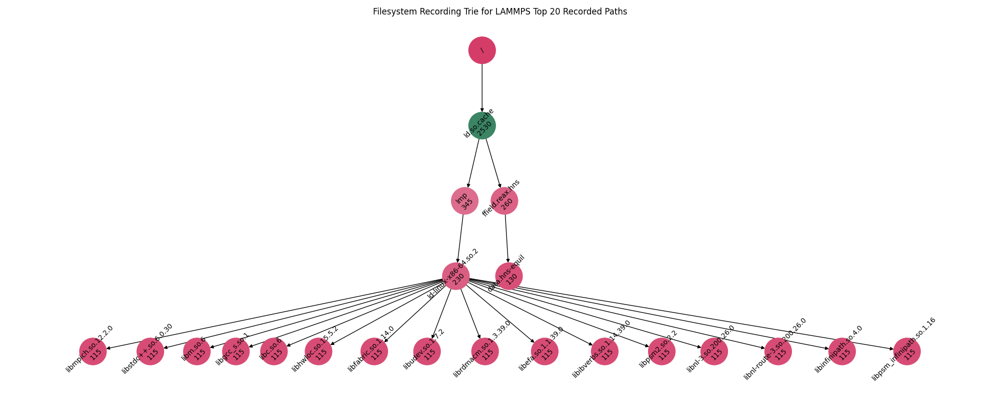

# Analysis Example

These are logs generated from the "same" executable across 86 LAMMPS builds. In this directory I want to:

1. Calculate Levenstein Distance (see below)
2. Try to visualize the access
3. Build a trie and put a count at each node that represents the number of paths that hit it.
4. Look at the actual output and derive if there are changes in the CPU utilization or total runtime.
5. Create features to describe patterns (file lookup or open, not accounting for timestamps), and measure how similar or different two sequences are
6. Can we do a total calculation of the percentage of files looked up over the total in the image?

For the last point - can we break files into groups based on access time, package that with metadata, and have that used for a pre-fetch strategy? Where groups are fetched before needed for an application?

## Usage

### 1. Levenstein Distance

Calculate distance between all pairs:

```bash
python analyze-recording.py $(find ../recording -name *.out)
```
```console
current allocation
                                    lammps-patch_31May2019.out  ... lammps-stable_23Jun2022_update2.out
lammps-patch_31May2019.out                                   0  ...                                   8
lammps-patch_21Jul2020.out                                   4  ...                                   9
lammps-patch_15Jun2020.out                                   3  ...                                   9
lammps-patch_2Aug2023.out                                   84  ...                                  76
lammps-patch_19Mar2020.out                                   0  ...                                   8
...                                                        ...  ...                                 ...
lammps-patch_24Aug2020.out                                   4  ...                                   9
lammps-patch_27Jun2024.out                                 153  ...                                 146
lammps-patch_24Jan2020.out                                   0  ...                                   8
lammps-patch_7Feb2024.out                                   84  ...                                  77
lammps-stable_23Jun2022_update2.out                          8  ...                                   0

[85 rows x 85 columns]
```

This shows levenstein distance, and I like this value because it's a count the represents the number of edits (deletions, subs, or additions) that we have to make to one set of paths to get to the other!


### 2. Visualize Access

Here we will visualize the access - a basic plot of the paths, and then make opacity based on access rate.
Note that the "Lookup" operation is only done once by the filesystem, but Open is done multiple times. So if we want to understand access patterns, we want the latter.  "Lookup" would be important for some kind of cache pre-fetcher because we only care about the first time we see something.

```bash
python plot-recording.py $(find ../recording -name *.out)
```

In the above, we create a heatmap where access is relative to the whole set (darker is accessed the most).
This means in the plot below, darker regions are accessed more. If colors are the same, the paths we acceessed the same number of times. It's fairly simple like that.


### 3. Trie to Describe patterns

We also generate a Trie. For the tree you need pygraphviz:

```bash
conda install --channel conda-forge pygraphviz
```
This took me two hours to write the code for - I wanted the colors to correspond to counts, and be relative to one another, and for the labels to be rotated. Worth it!



### 4. Output changes

Haven't written this yet!

### 5. Create Features to Describe Patterns

This is underway! I've designed the algorithm (not written here yet) and will get it implemented soon.
Below are just some notes from the weekend that might not be relevant.

- Do a compression (or summary of sequences) to get patterns (e.g., AAA, AAB)
- Make a histogram, so find frequency of each pattern
- Once we have histogram, canonicalize the sequences - within a pattern, rename the letters or pattern so always ordered in some way. (e.g., ABC would be the same as CDF because they both are "three different things coming after one another"

